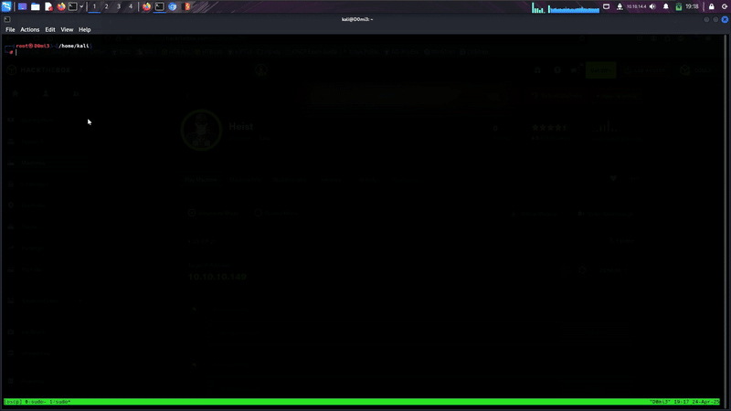

# CPScan - Quick and Efficient Pentesting Enum Script 🚀 
# Will aid you in exams like OSCP



CP Scan was created with pentesting in mind. It quickly identifies open ports, allowing you to start enumeration while a full scan runs in the background. The script generates clean output files and even performs subdirectory enumeration with **Feroxbuster** using its default wordlist (which you can change).  

## Features  
- **Fast port scanning**: Identifies open ports quickly.  
- **Detailed enumeration**: Runs a deep service scan on discovered ports.  
- **Subdirectory enumeration**: Uses Feroxbuster for HTTP services.  
- **Clean output files**: Saves results neatly for later analysis.  
- **Includes UDP scan**: Scans the top 100 UDP ports for additional attack surface.  

## Installation  
```bash
git clone https://github.com/domm-t/cpsan.git 
cd cpscan  
chmod +x cpscan.py  
```

## Run the script  
```bash
python3 cpscan.py <TARGET_IP>
```

## Add the script globally (optional)  
You can run `cpscan` from anywhere by adding it to `/usr/local/bin`:  
```bash
sudo cp cpscan.py /usr/local/bin/cpscan  
sudo chmod +x /usr/local/bin/cpscan  
```
Now you can run:  
```bash
cpscan <TARGET_IP>
```

## Dependencies  
Ensure you have the following installed:  
```bash
sudo apt install nmap  
sudo apt install feroxbuster  
```

## Example Usage  
```bash
cpscan 192.168.1.1
```
- Performs an **initial fast scan** to identify open ports.  
- Runs a **detailed service scan** on discovered ports.  
- Checks for **HTTP services** and **runs Feroxbuster** for directory enumeration.  
- Finally, performs a **UDP scan** on the top 100 ports.  

## Output Files  
Results are saved in a folder named `output_<TARGET_IP>`:  
```
output_192.168.1.1/
│── nmap_all_ports.txt
│── nmap_detailed_scan.txt
│── subdomain_enum_port_80.txt (if HTTP found)
│── udp_scan.txt
```

## Disclaimer  
This tool is intended for **legal** penetration testing and research **only**. **Do not use** it on unauthorized systems.  

---
⭐ **Star this repo if you find it useful!** 🚀  
